### The instructions below are for Windows, but the steps for Mac or Linux are similar
- Create a new Azure account
- Create a new subscription within that Azure account (TODO: flush these steps out)
-  On your local computer, install NodeJS
```
winget install -e --id OpenJS.NodeJS
```
- Create a barebones react app
```
npx create-react-app default-react-app
```
- Test it out
```
cd default-react-app
npm start
```
After a few seconds, a browser tab should open and you should see a barebones react app.
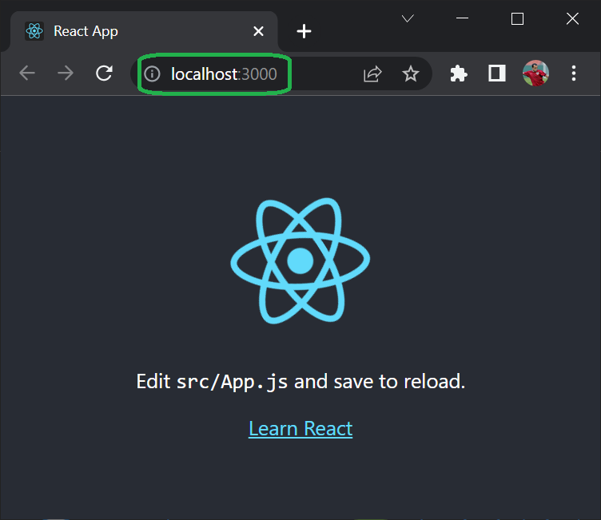

- Create a repository on github
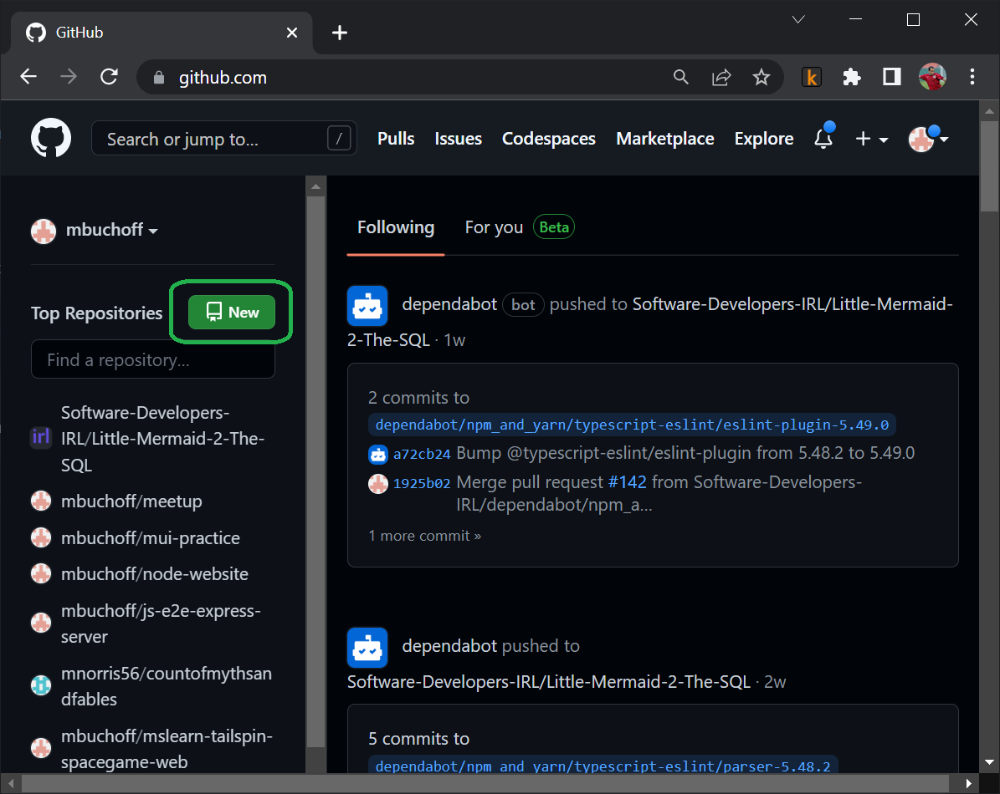
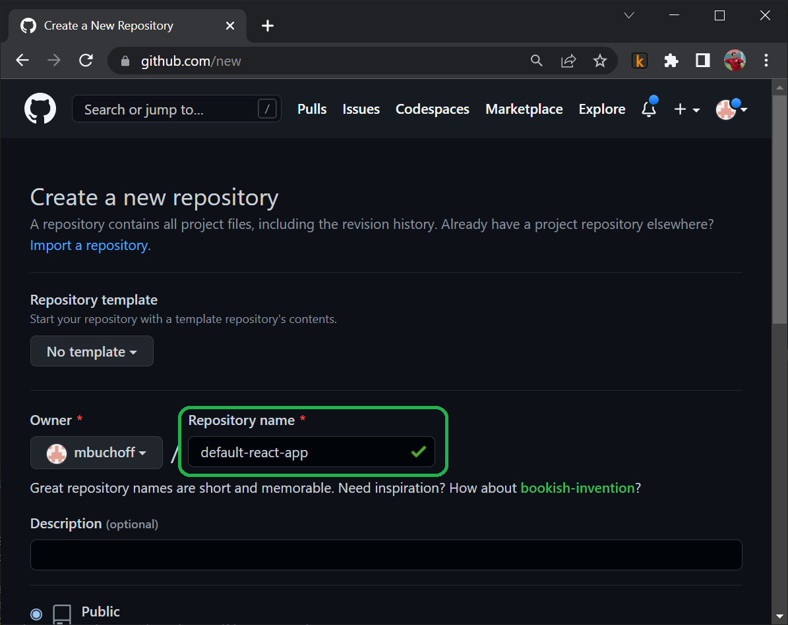
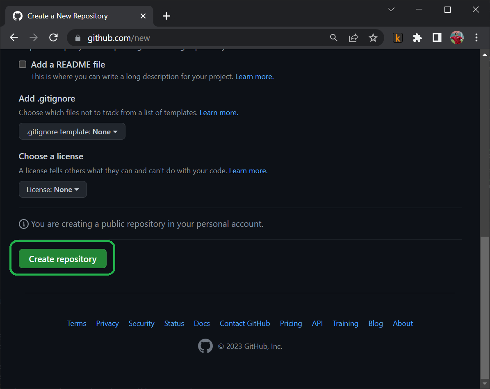

- Add your react app to your new repo by pasting these commands into the command line:
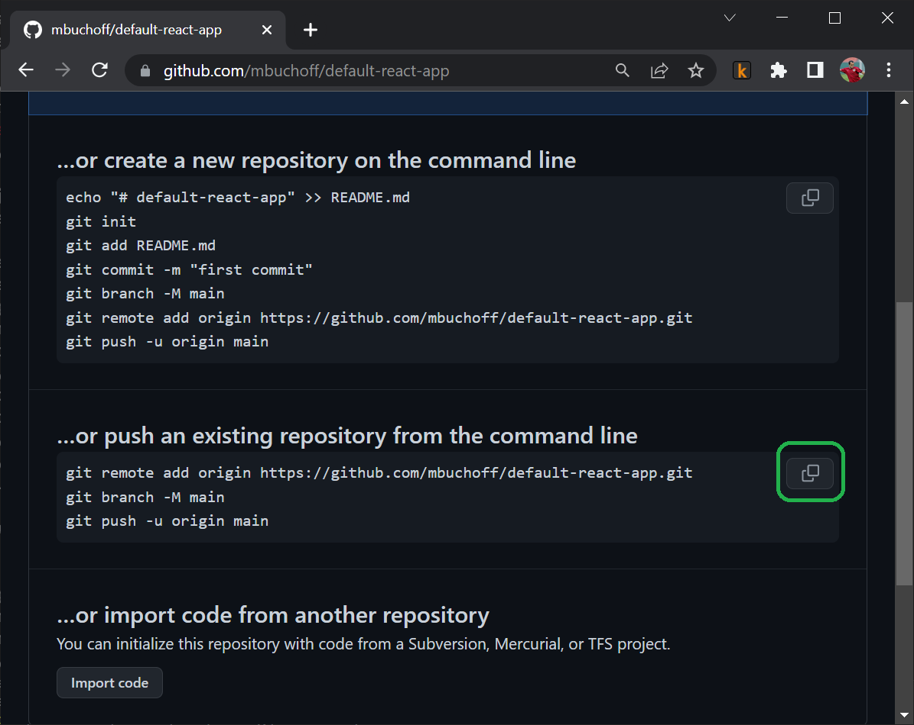
```
git remote add origin YOUR_REPO_URL
git branch -M main
git push -u origin main
```
- In the Azure portal, type "Static Web Apps" in the search bar and click the corresponding result.

- Click Create static web app.
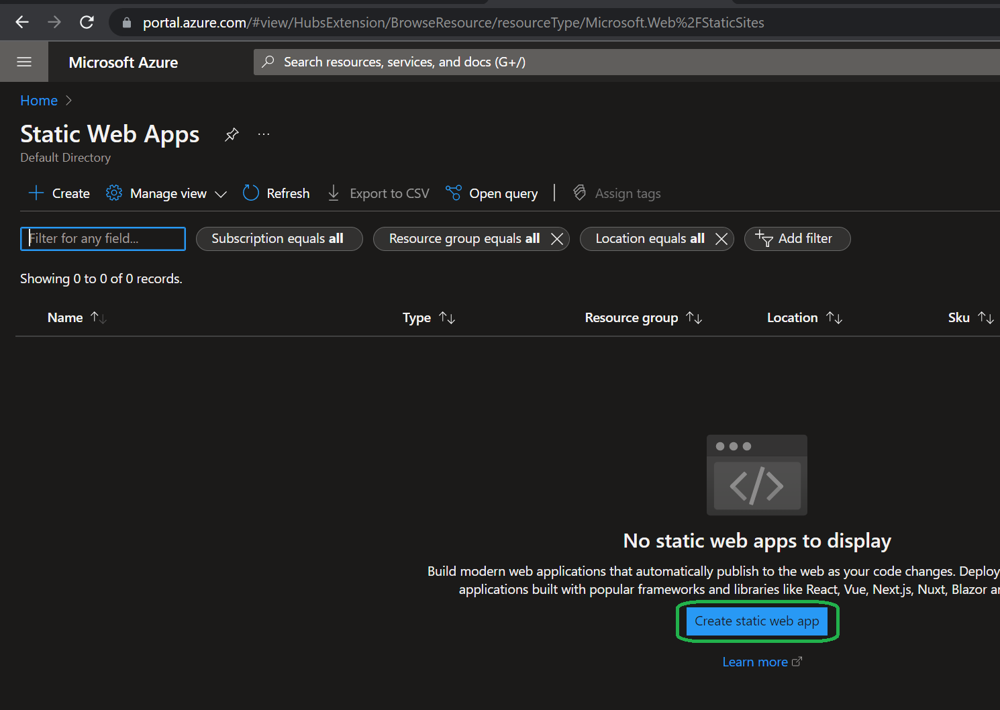
- Choose the subscription you created earlier.
- For the name, type _default-react-app_. Azure will suggest a new name for the corresponding resource group.
- Make sure the plan type is _free_.
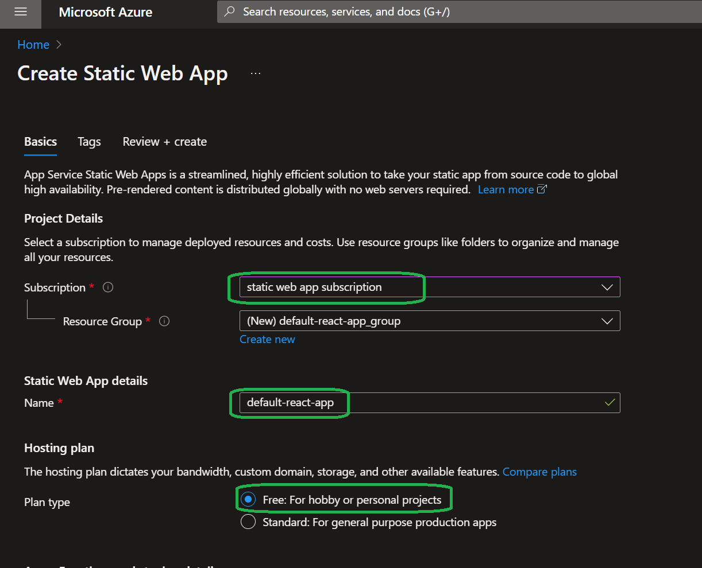
- Set the details that correspond to your git repo. The branch will be _main_.
- Click _Review + create_.
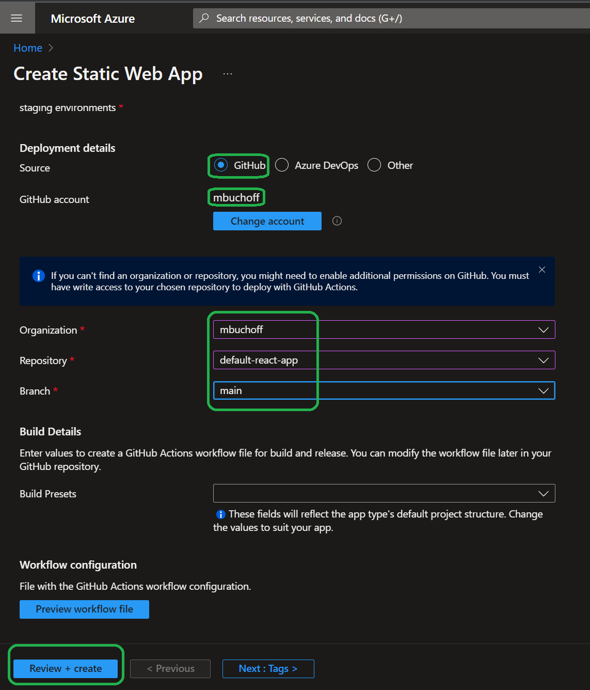
- Click _Create_.
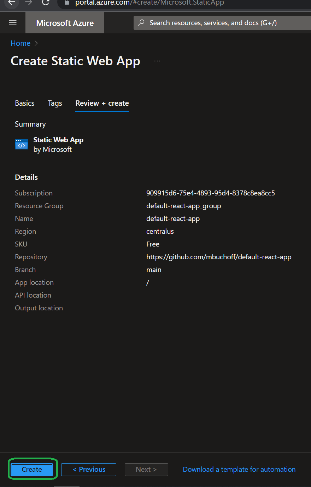
- _Click Go to resource_.
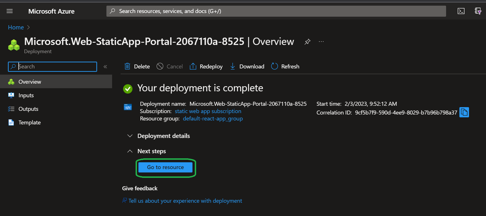
- Note that Azure has added an action to your github repo
```
git pull
git log -1 -p
```
Here was my output:
```
commit 9c9a9f18b639d77adb92b4cb427170750415ee50 (HEAD -> main, origin/main)
Author: Michael Buchoff <mbuchoff@gmail.com>
Date:   Fri Feb 3 09:52:16 2023 -0500

    ci: add Azure Static Web Apps workflow file
    on-behalf-of: @Azure opensource@microsoft.com

diff --git a/.github/workflows/azure-static-web-apps-lemon-beach-01c13d210.yml b/.github/workflows/azure-static-web-apps-lemon-beach-01c13d210.yml
new file mode 100644
index 0000000..65d2c4e
--- /dev/null
+++ b/.github/workflows/azure-static-web-apps-lemon-beach-01c13d210.yml
@@ -0,0 +1,45 @@
+name: Azure Static Web Apps CI/CD
+
+on:
+  push:
+    branches:
+      - main
+  pull_request:
+    types: [opened, synchronize, reopened, closed]
+    branches:
+      - main
+
+jobs:
+  build_and_deploy_job:
+    if: github.event_name == 'push' || (github.event_name == 'pull_request' && github.event.action != 'closed')
+    runs-on: ubuntu-latest
+    name: Build and Deploy Job
+    steps:
+      - uses: actions/checkout@v2
+        with:
+          submodules: true
+      - name: Build And Deploy
+        id: builddeploy
+        uses: Azure/static-web-apps-deploy@v1
+        with:
+          azure_static_web_apps_api_token: ${{ secrets.AZURE_STATIC_WEB_APPS_API_TOKEN_LEMON_BEACH_01C13D210 }}
+          repo_token: ${{ secrets.GITHUB_TOKEN }} # Used for Github integrations (i.e. PR comments)
+          action: "upload"
+          ###### Repository/Build Configurations - These values can be configured to match your app requirements. ######
+          # For more information regarding Static Web App workflow configurations, please visit: https://aka.ms/swaworkflowconfig
+          app_location: "/" # App source code path
+          api_location: "" # Api source code path - optional
+          output_location: "" # Built app content directory - optional
+          ###### End of Repository/Build Configurations ######
+
+  close_pull_request_job:
+    if: github.event_name == 'pull_request' && github.event.action == 'closed'
+    runs-on: ubuntu-latest
+    name: Close Pull Request Job
+    steps:
+      - name: Close Pull Request
+        id: closepullrequest
+        uses: Azure/static-web-apps-deploy@v1
+        with:
+          azure_static_web_apps_api_token: ${{ secrets.AZURE_STATIC_WEB_APPS_API_TOKEN_LEMON_BEACH_01C13D210 }}
+          action: "close"
```

- In the webapp overview page, click the _Github Action runs_.
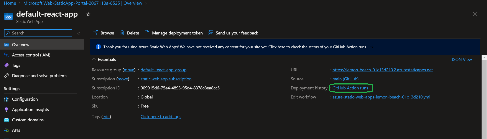
- After a minute or so, the action will succeed and you will see a green checkmark.
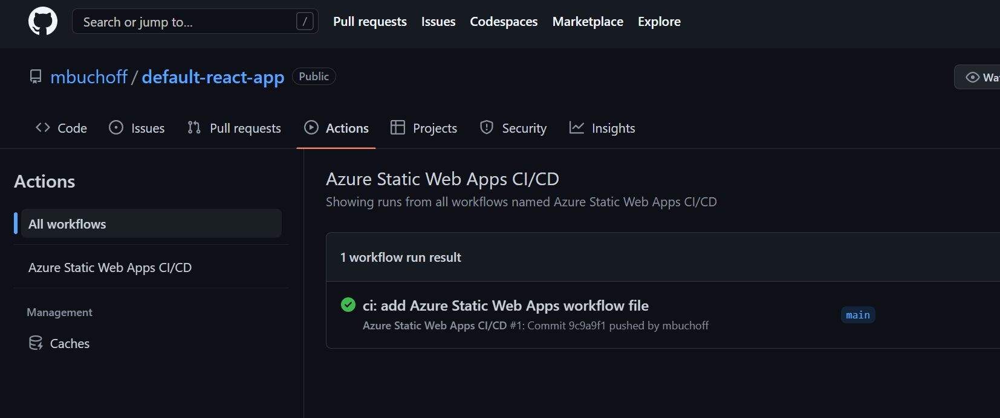
- Navigate back to the webapp in Azure and click the _URL_
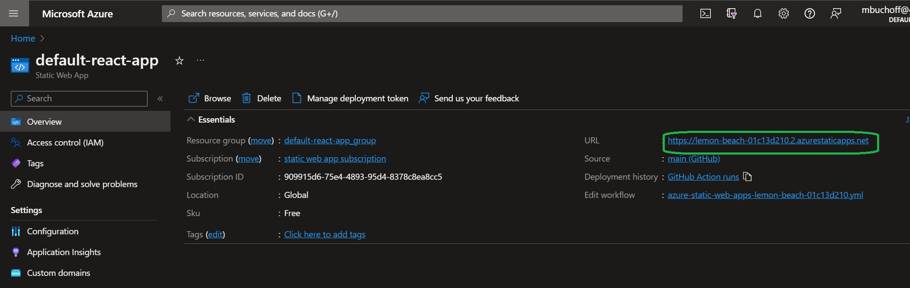
- You will see your default React App served on Azure. You can try this link out on your phone, give it to friends, etc..
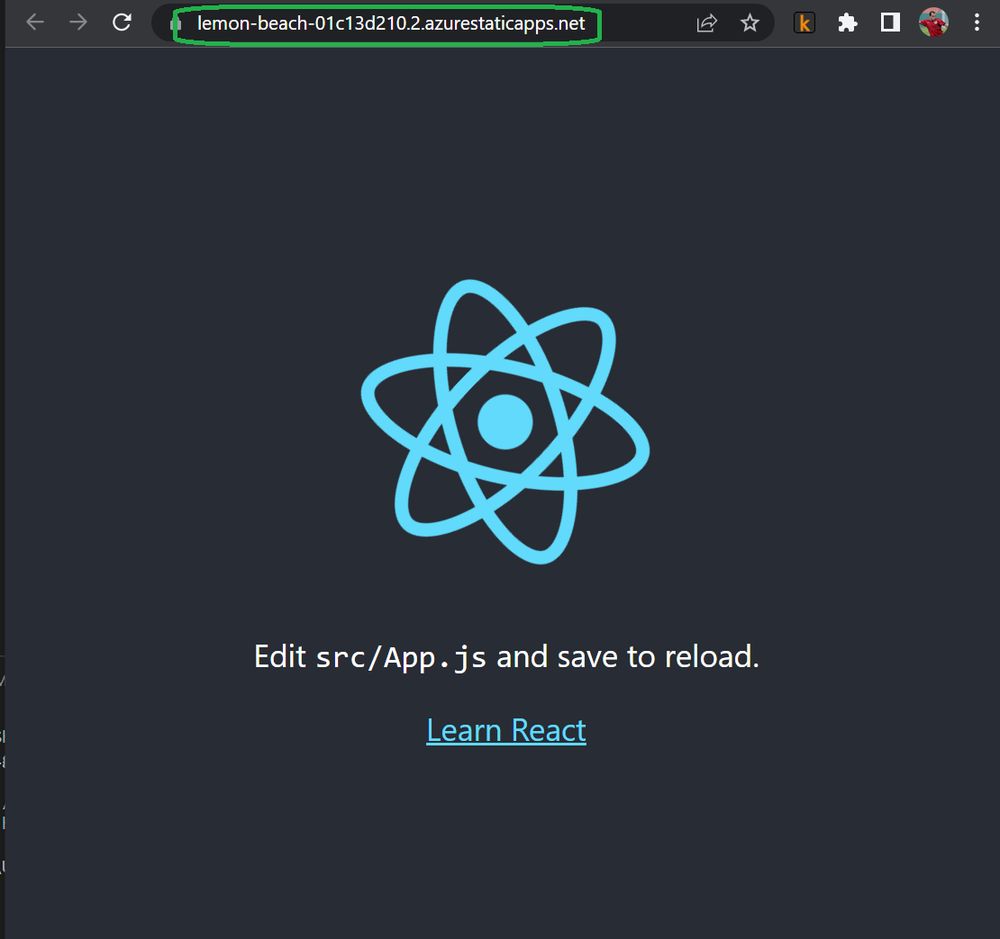
- Modify something small on your GitHub repo. In my example, I exported https://www.iconbolt.com/iconsets/emoji/emoji-emoticon-silly as a png (Node seems pretty picky about svgs) and referenced it in app.js. then rerun `npx start` to see your change.
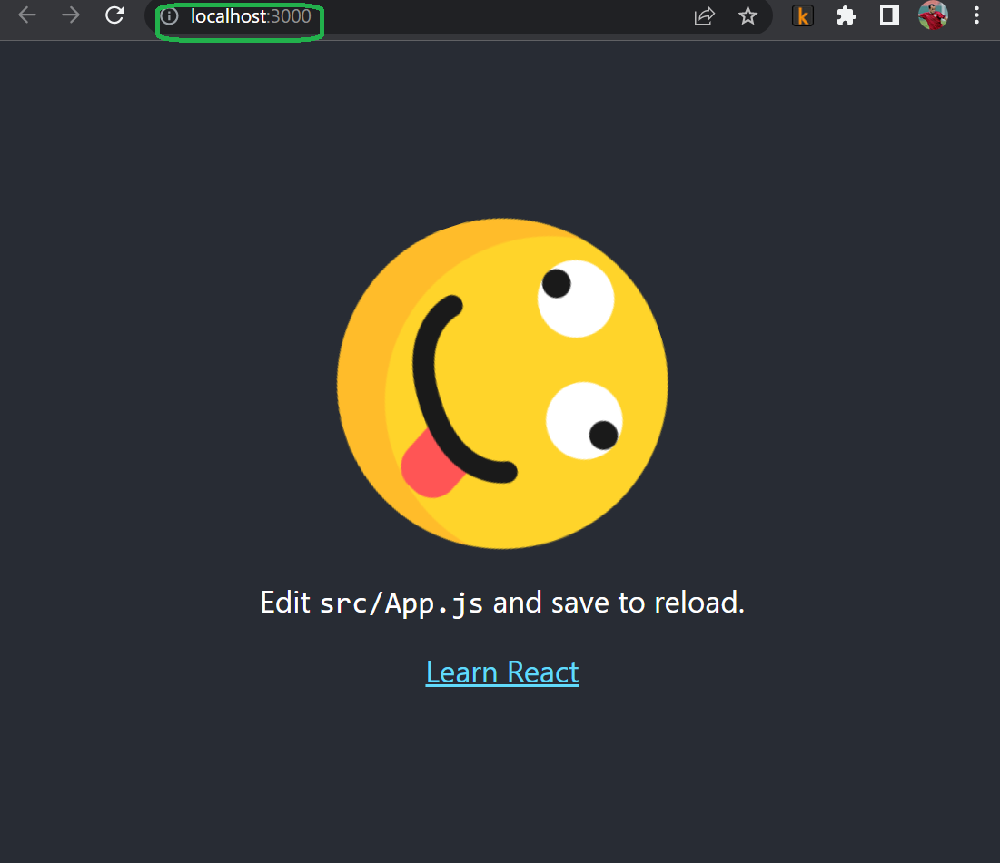
- Push the changes to GitHub
```
git add *
git commit * -m "Made a small change to my React app"
git push
```
- A new GitHub action will kick off. After about a minute or so, it will complete and you will see your changes served from Azure.
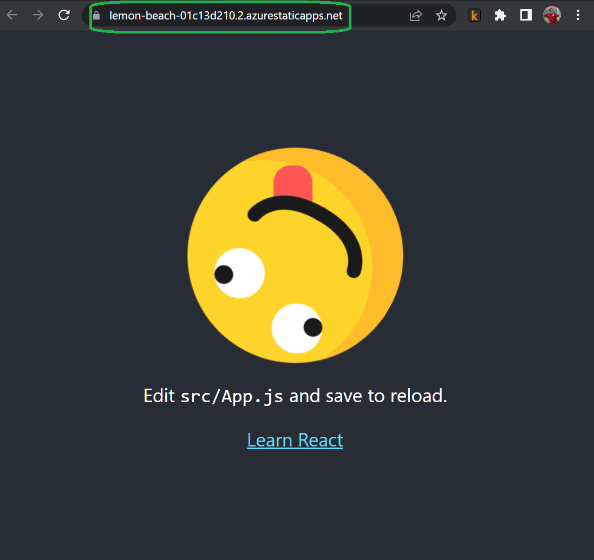