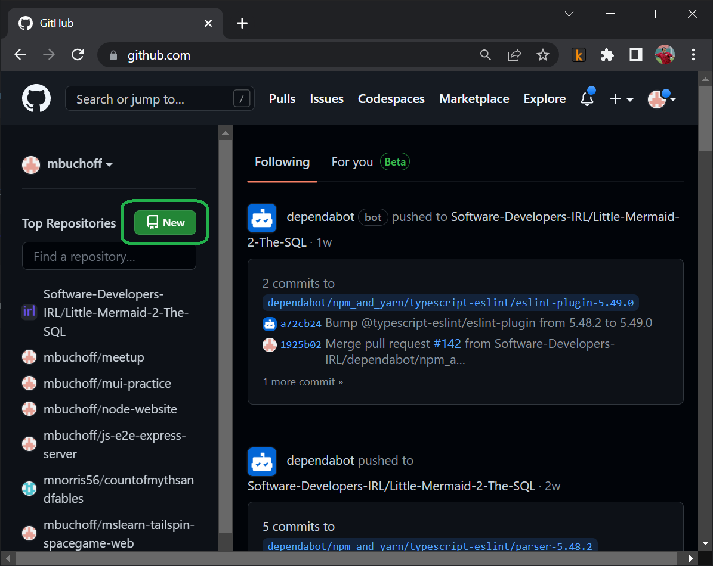

### The instructions below are for Windows, but the steps for Mac or Linux are similar
- Create a new Azure account
- Create a new subscription within that Azure account (TODO: flush these steps out)
-  On your local computer, install NodeJS
```
winget install -e --id OpenJS.NodeJS
```
- Create a barebones react app
```
npx create-react-app default-react-app
```
- Test it out
```
cd default-react-app
npm start
```
After a few seconds, a browser tab should open and you should see a barebones react app.


- Create a repository on github



- Add your react app to your new repo by pasting these commands into the command line:

```
git remote add origin YOUR_REPO_URL
git branch -M main
git push -u origin main
```
